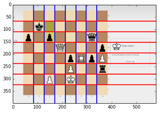
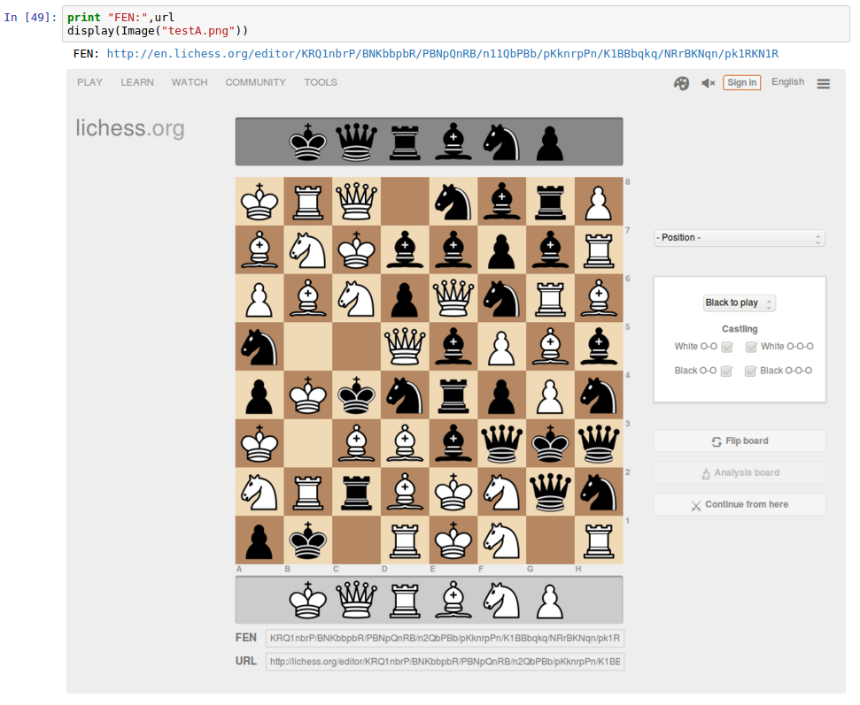
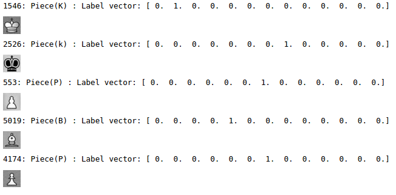
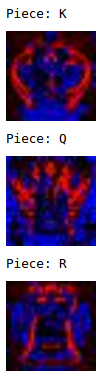

TensorFlow Chessbot - [/u/ChessFenBot](https://www.reddit.com/user/ChessFenBot) [◕ _ ◕]<sup>\* *I make FENs*</sup>
---

**TL;DR**: 
> Turn http://i.imgur.com/HnWYt8A.png → [1nkr4/1p3q1p/pP4pn/P1r5/3N1p2/2b2B1P/5PPB/2RQ1RK1](https://lichess.org/analysis/1nkr4/1p3q1p/pP4pn/P1r5/3N1p2/2b2B1P/5PPB/2RQ1RK1_w)


A [TensorFlow](www.tensorflow.org) [Convolutional Neural Network](https://en.wikipedia.org/wiki/Convolutional_neural_network) algorithm trained on 32x32 grayscale chess tiles predicts chessboards layouts from online chessboard screenshots.

* 5x5x32 Input Convolution layer
* 5x5x64 Convolution layer
* 8x8x1024 Dense Fully Connected layer
* 1024x13 Dropout + Softmax Readout layer

Yes, using a CNN is kinda overkill, but it is *exciting*.

### Running Tensorflow_Chessbot on images locally and via URLs

On a linux machine which has Tensorflow and SciPy installed

* [Tensorflow Install instructions](https://www.tensorflow.org/versions/r0.9/get_started/os_setup.html)
* [SciPy Install Instructions](https://www.scipy.org/install.html), possibly as easy as this on Ubuntu

        sudo apt-get install python-numpy python-scipy python-matplotlib ipython ipython-notebook python-pandas python-sympy python-nose

Download the chessfenbot branch somewhere : [tensorflow_chessbot/chessfenbot](https://github.com/Elucidation/tensorflow_chessbot/archive/chessfenbot.zip) 

*Alternatively clone the [chessfenbot branch](https://github.com/Elucidation/tensorflow_chessbot/tree/chessfenbot)*

Now, to run pass the following arguments to `tensorflow_chessbot.py`

    $ ./tensorflow_chessbot.py -h
    usage: tensorflow_chessbot.py [-h] [--url URL] [--filepath FILEPATH]
    
    Predict a chessboard FEN from supplied local image link or URL
    
    optional arguments:
      -h, --help           show this help message and exit
      --url URL            URL of image (ex. http://imgur.com/u4zF5Hj.png)
      --filepath FILEPATH  filepath to image (ex. u4zF5Hj.png)

By default, it will try and load the URL `http://imgur.com/u4zF5Hj.png` and make a prediction in it, otherwise, you could pass a local file like so (for example with an image file `u4zF5Hj.png` located in the same directory):

    ./tensorflow_chessbot.py --filepath u4zF5Hj.png

Which should output something like:

    ./tensorflow_chessbot.py --filepath ./u4zF5Hj.png
    Setting up CNN TensorFlow graph...
    I tensorflow/core/common_runtime/local_device.cc:40] Local device intra op parallelism threads: 2
    I tensorflow/core/common_runtime/direct_session.cc:58] Direct session inter op parallelism threads: 2
    Loading model 'saved_models/model_10000.ckpt'
    Model restored.
    Certainty range [0.999545 - 1], Avg: 0.999977, Overall: 0.998546
    Predicted FEN: 11111111/11111p11/11111k1P/11p1111P/1p1p1111/11111111/111K1111/11111111
    Certainty: 99.9%
    Done


Similarly, a URL can be tested by calling with a URL:

    $ ./tensorflow_chessbot.py --url http://imgur.com/u4zF5Hj.png

### Reddit Bot

*Code lives on the [chessfenbot branch](https://github.com/Elucidation/tensorflow_chessbot/tree/chessfenbot)*

[/u/ChessFenBot](https://www.reddit.com/user/ChessFenBot) will automatically reply to [reddit /r/chess](https://www.reddit.com/r/) new topic image posts that contain detectable online chessboard screenshots. A screenshot either ends in `.png`, `.jpg`, `.gif`, or is an `imgur` link. 

It replies with a [lichess](https://lichess.org) analysis link for that layout and a predicted [FEN](https://en.wikipedia.org/wiki/Forsyth%E2%80%93Edwards_Notation).

```py
predictor = ChessboardPredictor()
fen, certainty = predictor.makePrediction('http://imgur.com/u4zF5Hj.png')
print "Predicted FEN: %s" % fen
print "Certainty: %.1f%%" % (certainty*100)
```

```
Certainty range [0.999545 - 1], Avg: 0.999977, Overall: 0.998546
Predicted FEN: 8/5p2/5k1P/2p4P/1p1p4/8/3K4/8
Certainty: 99.9%
Done
[Finished in 1.8s]
```

ChessFenBot automatically replied to [this reddit post](https://www.reddit.com/r/chess/comments/45osos/very_difficult_find_the_best_move_for_white/d004cg6?context=3), it processed the [screenshot link url](http://i.imgur.com/HnWYt8A.png) and responded with:

> ChessFenBot [◕ _ ◕]<sup>\* *I make FENs*</sup>
> 
> ---
> 
> I attempted to generate a chessboard layout from the posted image, with an overall certainty of **99.9916%**.
> 
> FEN: [1nkr4/1p3q1p/pP4pn/P1r5/3N1p2/2b2B1P/5PPB/2RQ1RK1](http://www.fen-to-image.com/image/30/1nkr1111/1p111q1p/pP1111pn/P1r11111/111N1p11/11b11B1P/11111PPB/11RQ1RK1.png)
> 
> Here is a link to a [Lichess Analysis](https://lichess.org/analysis/1nkr4/1p3q1p/pP4pn/P1r5/3N1p2/2b2B1P/5PPB/2RQ1RK1_w) - White to play
> 
> ---
> 
> <sup>Yes I am a machine learning bot | [`How I work`](https://github.com/Elucidation/tensorflow_chessbot 'Must go deeper') | Reply with a corrected FEN or [Editor link)](https://lichess.org/editor/r1b1r1k1/5pp1/p1pR1nNp/8/2B5/2q5/P1P1Q1PP/5R1K) to add to my next training dataset</sup>

## Workflow

There are three ipython notebooks which show the workflow from turning a screenshot of a chessboard into a set of 32x32 grayscale tiles, to generating those tiles for training and testing, and then the actual training and learning of the neural network from those trials using [TensorFlow](http://www.tensorflow.org).

1. [tensorflow_compvision.ipynb](tensorflow_compvision.ipynb) - Computer Vision
1. [tensorflow_generate_training_data.ipynb](tensorflow_generate_training_data.ipynb) - Generating a dataset from set of screenshots of chessboards in known configurations
1. [tensorflow_learn.ipynb](tensorflow_learn.ipynb) - **TensorFlow Neural Network Training & Prediction** Basic Regression classifier, works for more common lichess.org and chess.com screenshots
1. [tensorflow_learn_cnn.ipynb](tensorflow_learn_cnn.ipynb) - **TensorFlow Convolutional Neural Network Training & Prediction** tested with ~73% success rate on 71 chess subreddit posts

---

#### [tensorflow_compvision.ipynb](tensorflow_compvision.ipynb) - 1. Computer Vision

Here is a screenshot with the detected lines of the chessboard overlaid, showing where we'll cut the image into tiles.



---

####  [tensorflow_generate_training_data.ipynb](tensorflow_generate_training_data.ipynb) - 2. Generating a dataset

[Lichess.org](lichess.org) provides a URL interface with a FEN string that loads a webpage with that board arrayed. A nice repo called [pythonwebkit2png](https://github.com/adamn/python-webkit2png) provides a way to render webpages programmatically, allowing us to generate several (80 in thise) random FEN strings, load the URL and take a screenshot all automatically.



Here is 5 example tiles and their associated label, a 13 length one-hot vector corresponding to 6 white pieces, 6 black pieces, and 1 empty space.



---

#### [tensorflow_learn.ipynb](tensorflow_learn.ipynb) - 3. TensorFlow Neural Network Training & Prediction

We train the neural network on generated data from 80 lichess.org screenshots, which is 5120 tiles. We test it with 5 screenshots (320 tiles) as a quick sanity check. Here is a visualization of the weights for the white King, Queen and Rook.



Finally we can make predictions on images passed by URL, the ones from lichess and visually similar boards work well, the ones that are too different from what we trained for don't work, suggesting that getting more data is in order. Here is a prediction on the image for [this reddit post](https://www.reddit.com/r/chess/comments/45inab/moderate_black_to_play_and_win/)


---

#### [tensorflow_learn_cnn.ipynb](tensorflow_learn_cnn.ipynb) - TensorFlow Convolutional Neural Network Training & Prediction

Built a slightly larger dataset of ~150 screenshots which is around 9600 tiles which includes randomized FEN diagrams from lichess.org, chess.com, and 2 FEN generated diagram sites.

Tested with ~73% success rate on 71 chess subreddit posts, good enough to make a first draft Reddit bot.

---

### Ideation
Reddit post has an image link (perhaps as well as a statement "white/black to play").

Bot takes the image, uses some CV to find a chessboard on it, splits up into
a set of images of squares. These are the inputs to the tensorflow CNN
which will return probability of which piece is on it (or empty)

Dataset will include chessboard squares from chess.com, lichess
Different styles of each, all the pieces

Generate synthetic data via added noise:
 * change in coloration
 * highlighting
 * occlusion from lines etc.

Take most probable set from TF response, use that to generate a FEN of the
board, and bot comments on thread with FEN and link to lichess analysis
