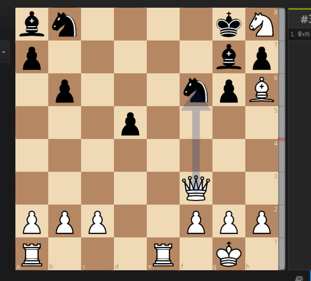

TensorFlow Chessbot - /u/ChessFenBot [◕ _ ◕]<sup>\* *I make FENs*</sup>
---
## Command Line Interface (CLI)

### Setting up the virtual environment

This uses Python 3, pip3 and virtualenv, if you don't have these installed you can use:

```
sudo apt-get install python3-pip
sudo pip3 install virtualenv
```

Then, create a new virtual environment, source it, and install the dependencies from `requirements.txt`.

```
virtualenv venv
source venv/bin/activate
pip3 install -r requirements.txt 
```

### Running the CLI

`tensorflow_chessbot.py` contains the library and script for running predictions on images passed by file or url.

```
$ ./tensorflow_chessbot.py -h
usage: tensorflow_chessbot.py [-h] [--url URL] [--filepath FILEPATH]
 
 Predict a chessboard FEN from supplied local image link or URL
 
 optional arguments:
   -h, --help           show this help message and exit
   --url URL            URL of image (ex. http://imgur.com/u4zF5Hj.png)
  --filepath FILEPATH  filepath to image (ex. u4zF5Hj.png)
```

For example to run on the provided `example_input.png` 

```
./tensorflow_chessbot.py --filepath example_input.png
```

Should output something like:

```
(venv) $ ./tensorflow_chessbot.py --filepath example_input.png

--- Prediction on file example_input.png ---
   Loading model 'saved_models/frozen_model.pb'
   Model restored.
Closing session.
Per-tile certainty:
[[1. 1. 1. 1. 1. 1. 1. 1.]
 [1. 1. 1. 1. 1. 1. 1. 1.]
 [1. 1. 1. 1. 1. 1. 1. 1.]
 [1. 1. 1. 1. 1. 1. 1. 1.]
 [1. 1. 1. 1. 1. 1. 1. 1.]
 [1. 1. 1. 1. 1. 1. 1. 1.]
 [1. 1. 1. 1. 1. 1. 1. 1.]
 [1. 1. 1. 1. 1. 1. 1. 1.]]
Certainty range [0.999975 - 1], Avg: 0.999997
---
Predicted FEN: bn4kN/p5bp/1p3npB/3p4/8/5Q2/PPP2PPP/R3R1K1
Final Certainty: 100.0%
```

Which would be 


## Reddit Bot

[/u/ChessFenBot](https://www.reddit.com/user/ChessFenBot) will automatically reply to [reddit /r/chess](https://www.reddit.com/r/) new topic image posts that contain detectable online chessboard screenshots. A screenshot either ends in `.png`, `.jpg`, `.gif`, or is an `imgur` link. 

It replies with a [lichess](http://www.lichess.org) analysis link for that layout and a predicted [FEN](https://en.wikipedia.org/wiki/Forsyth%E2%80%93Edwards_Notation).

```py
predictor = ChessboardPredictor()
fen, certainty = predictor.makePrediction('http://imgur.com/u4zF5Hj.png')
print "Predicted FEN: %s" % fen
print "Certainty: %.1f%%" % (certainty*100)
```

```
Certainty range [0.999545 - 1], Avg: 0.999977, Overall: 0.998546
Predicted FEN: 8/5p2/5k1P/2p4P/1p1p4/8/3K4/8
Certainty: 99.9%
Done
[Finished in 1.8s]
```

ChessFenBot automatically replied to [this reddit post](https://www.reddit.com/r/chess/comments/45osos/very_difficult_find_the_best_move_for_white/d004cg6?context=3), it processed the [screenshot link url](http://i.imgur.com/HnWYt8A.png) and responded with:

> ChessFenBot [◕ _ ◕]<sup>\* *I make FENs*</sup>
> 
> ---
> 
> I attempted to generate a chessboard layout from the posted image, with an overall certainty of **99.9916%**.
> 
> FEN: [1nkr4/1p3q1p/pP4pn/P1r5/3N1p2/2b2B1P/5PPB/2RQ1RK1](http://www.fen-to-image.com/image/30/1nkr1111/1p111q1p/pP1111pn/P1r11111/111N1p11/11b11B1P/11111PPB/11RQ1RK1.png)
> 
> Here is a link to a [Lichess Analysis](http://www.lichess.org/analysis/1nkr4/1p3q1p/pP4pn/P1r5/3N1p2/2b2B1P/5PPB/2RQ1RK1_w) - White to play
> 
> ---
> 
> <sup>Yes I am a machine learning bot | [`How I work`](https://github.com/Elucidation/tensorflow_chessbot 'Must go deeper') | Reply with a corrected FEN or [Editor link)](http://www.lichess.org/editor/r1b1r1k1/5pp1/p1pR1nNp/8/2B5/2q5/P1P1Q1PP/5R1K) to add to my next training dataset</sup>

## Running with Docker

Automated build on Docker available at `elucidation/tensorflow_chessbot`

Populate your own `auth_config.py` which has the form

```py
USERNAME='<NAME>'
PASSWORD='<PASSWORD>'
USER_AGENT='<AGENT INFO>'
```


Then you can download and run the docker image passing this config file using:

```
docker run -dt --rm --name cfb -v <local_auth_file>:/tcb/auth_config.py elucidation/tensorflow_chessbot
```
